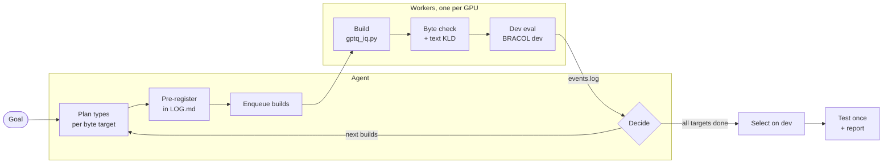

# Agentic GGUF quantization

Give an AI agent (Claude Code) one goal; it runs the quantization loop by itself until every size target has a file,
then selects, tests and reports. Built on stock [llama.cpp](https://github.com/ggml-org/llama.cpp) (`9a7570587`);
outputs are ordinary GGUF files.

## Start

```bash
cd agentic-quantization
cp loop/env.example.sh loop/env.sh   # set paths
claude
```
> Quantize Qwen3.5-2B to fit LM + Q8_0 mmproj under 1 GB, and beat the public GGUFs on BRACOL dev. Use GPUs 0–3.

More requests: [`example-run/prompts.md`](example-run/prompts.md).

## The loop



## Layout

| Path | What |
|---|---|
| `CLAUDE.md` (= `AGENTS.md`) | agent rules |
| `.claude/skills/gguf-quant-loop/` | loop procedure, commands, lessons |
| `loop/` | workers, queue, event wait, status |
| `quantizer/` | `gptq_iq.py`, type planning (`plan_alloc.py`, `retype_template.py`) |
| `benchmark/` | evaluation harness |
| `protocol/`, `manifest*.csv`, `data/` | frozen prompt, image lists, public GGUF log |
| `selection/`, `results/` | built files and picks; quantization scores |
| `example-run/` | logs of the real run (2026-10-04) |

## Method

1. **Types:** start from an Unsloth GGUF, move tensors up/down to fit the byte budget.
2. **Values:** GPTQ with llama.cpp's own rounding (`ggml_quantize_chunk`), error carried across blocks.
3. **Calibration:** text + images through the vision tower — generic COCO (*ours-general*) or BRACOL dev (*ours-task*).
4. **Selection:** on dev, by a rule written before any test run.

`llama-quantize --imatrix` can produce the same types and bytes; it lacks the error correction and image calibration.
`results/summary.md` measures that difference at matched sizes.

The released base `Qwen3.5-2B-coffee-base-Q2.gguf` is `Qwen3.5-2B-ours-task-1GBpkg-eQ2_K.gguf` in `selection/` (SHA-256 `cb88d42f…`).
